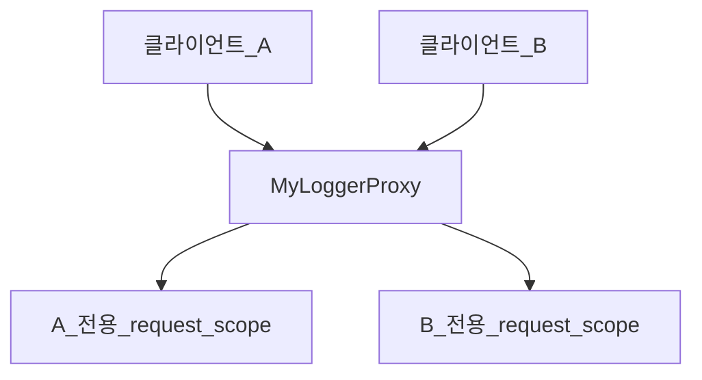

## 빈 스코프란?

스프링 빈은 스프링 컨테이너의 시작→ 종료까지 유지된다.

스프링 빈이 기본적으로 싱글톤 스코프로 생성되기 때문.

스코프 : 빈이 존재할 수 있는 범위

### 스프링의 스코프 종류

- 싱글톤 : 기본 스코프, 스프링 컨테이너의 시작과 종료까지 유지되는 가장 넒은 생명주기를 가짐
- 프로토타입 : 빈의 생성과 의존 관계 주입까지만 관여하고 더는 관리하지 않는 짧은 범위
- 웹 관련 스코프
  - request : 웹 요청이 들어오고 나갈때 까지 유지되는 스코프
  - session : 웹 세션이 생성되고 종료될 때 까지 유지되는 스코프
  - application : 웹의 서블릿 컨텍스트와 같은 범위로 유지되는 스코프

## 프로토타입 스코프

싱글톤 스코프 빈을 조회하면 스프링 컨테이너는 항상 같은 인스턴스의 스프링 빈을 반환한다.

프로토타입 스코프는 컨테이너에 조회하면 컨테이너는 항상 새로운 인스턴스를 생성해서 반환한다.

1. 프로토타입 스코프 빈을 스프링 컨테이너에 요청한다.
2. 컨테이너는 프로토타입 빈을 생성하고, 필요한 의존관계를 주입한다.
3. 새로운 요청이 들어오면 2를 다시 반복한다.

즉, 요청 하나하나 마다 새로운 객체가 생성된다.

<aside>
💡 정리

- 프로토타입 빈을 생성하고, 위존관계 주입, 초기화까지만 처리한다.
- 스프링 컨테이너는 생성된 빈을 관리하지 않는다.
- 컨테이너에 의해 더 이상 관리하지 않기 때문에 컨테이너가 종료될 때 @PreDestroy 같은 종료 메서드가 호출되지 않는다. destroy로 종료시켜야한다.
</aside>

## 프로토타입 스코프 - 싱글톤 빈과 사용시 문제점

```java
@Test
void singletonClientUsePrototype() {
    AnnotationConfigApplicationContext ac =
            new AnnotationConfigApplicationContext(ClientBean.class, PrototypeBean.class);

    ClientBean clientBean1 = ac.getBean(ClientBean.class);
    int count1 = clientBean1.logic();
    assertThat(count1).isEqualTo(1);
    ClientBean clientBean2 = ac.getBean(ClientBean.class);
    int count2 = clientBean2.logic();
    assertThat(count2).isEqualTo(2);
}

@RequiredArgsConstructor
static class ClientBean {
    private final PrototypeBean prototypeBean;

    public int logic() {
        prototypeBean.addCount();
        return prototypeBean.getCount();
    }
}

@Getter
@Scope("prototype")
static class PrototypeBean {
    private int count = 0;

    public void addCount() {
        count++;
    }

    @PostConstruct
    public void init() {
        System.out.println("PrototypeBean.init" + this);
    }

    @PreDestroy
    public void destroy() {
        System.out.println("PrototypeBean.destroy");
    }

}
```

싱글톤 빈에서 프로토타입 스코프를 가진 빈을 참조 중일 때 문제가 발생한다.

프로토타입 스코프는 쓸때마다 바로바로 생성하고 없애고 싶은데, 싱글톤 빈 안에 있기 때문에 계속 유지가 된다. 싱글톤 빈이 계속 잡고 있으니깐, 소멸되기 까지는 계속 붙잡혀 있기 때문이다.

## 프로토타입 스코프 - 싱글톤 빈과 사용시 Provider로 문제해결

싱글톤 빈과 프로토타입 빈 같이 사용 시, 새로운 프로토타입 빈을 생성하는 방법

### 스프링 컨테이너에 요청

스프링 컨테이너에 매번 새로운 프로토타입 빈을 요청한다.

```java
AnnotationConfigApplicationContext ac = new AnnotationConfigApplicationContext(PrototypeBean.class);
PrototypeBean prototypeBean1 = ac.getBean(PrototypeBean.class);
```

- `ac.getBean` 으로 항상 새로운 프로토타입 빈이 생성된다.
- 의존 관계를 외부에서 주입 받는게 아니라 직접 필요한 의존 관계를 찾는 것을 Dependency Lookup (DL) 의존관계 조회(탐색)이라고 한다.
- 하지만 앱 컨텍스트 전체를 주입 받게 되면, 스프링 컨테이너에 종속적인 코드가 되고, 단위 테스트도 어려워진다

### ObjectFactory, ObjectProvider

- 빈을 컨테이너에서 대신 찾아주는 DL 서비스를 제공하는 것이 `ObjectProvider`
- `ObjectProvider`는`ObjectFactory` 의 기능을 추가한 것. getObject는 원래 `ObjectFactory` 의 기능.
- getObject 가 DL을 해준다.
- 스프링이 제공하는 기능을 사용하지만 단위 테스트를 만들거나 mock 코드를 만들기는 훨씬 쉬워진다.

```java
@RequiredArgsConstructor
static class ClientBean {

    private final ObjectProvider<PrototypeBean> prototypeBeanObjectProvider;

    public int logic() {
        PrototypeBean prototypeBean = prototypeBeanObjectProvider.getObject();
        prototypeBean.addCount();
        return prototypeBean.getCount();
    }
}
```

빈을 사용하고 싶을 때 바로바로 생성하고 없애줄 때는 ObjectProvider를 사용하자!

## 웹 스코프

### 웹 스코프 특징

- 웹 환경에서만 동작.
- 프로토 타입과 다르게 스프링이 해당 스코프의 종료 시점까지 관리한다. 따라서 종료 메서드가 호출된

### 웹 스코프 종류

- request : HTTP 요청 하나가 들어오고 나갈 때 까지 유지되는 스코프, 요청마다 별도의 빈 인스턴스가 생성, 관리된다.
- session : HTTP Session과 동일한 생명주기를 가지는 스코프
- application : 서블릿 컨텍스트와 동일한 생명주기를 가지는 스코프
- websocket : 웹 소켓과 동일한 생명주기를 가지는 스코프


## requst 스코프 예제 만들기

```java
//web 라이브러리 추가
implementation 'org.springframework.boot:spring-boot-starter-web' 
```

spring-boot-starter-web 라이브러리를 추가하면 스프링 부트는 내장 톰켓 서버를 활용해서 웹 서
버와 스프링을 함께 실행시킨다.

```java
Tomcat started on port(s): 8080 (http) with context path ''
Started CoreApplication in 0.914 seconds (JVM running for 1.528)
```

> 웹 라이브러리가 없으면 `AnnotationConfigApplicationContext` 을 기반으로 앱을 구동한다.
웹 라이브러리가 추가되면 웹 관련 설정과 환경들이 필요하기 때문에 `AnnotationConfigServletWebServerApplicationContext` 를 기반으로 앱을 구동한다.
>

### request 스코프 예제

reqest 스코프를 사용하면 여러 HTTP 요청의 로그를 구분 지을 수 있다.

- 기대하는 공통 포멧: [UUID] [requestURL] {message}
- UUID를 사용해서 HTTP 요청을 구분.
- requestURL 정보도 추가로 넣어서 어떤 URL을 요청해서 남은 로그인지 확인.

```java
@Component
@Scope(value = "request")
@Setter
public class MyLogger {
    private String uuid;
    private String requestURL;

    public void log(String message) {
        System.out.println("[" + uuid + "] "
                + "[" + requestURL + "] "
                + message);
    }

    @PostConstruct
    public void init() {
        uuid = UUID.randomUUID().toString();
        System.out.println("[" + uuid + "] request scope bean create: "
                + this);
    }

    @PreDestroy
    public void close() {
        System.out.println("[" + uuid + "] request scope bean close: "
                + this);
    }
}
```

```java
@Controller
@RequiredArgsConstructor
public class LogDemoController {

    private final LogDemoService logDemoService;
    private final MyLogger myLogger;

    @RequestMapping("log-demo")
    @ResponseBody
    public String logDemo(HttpServletRequest request) {
        String requestURL = request.getRequestURL().toString();
        myLogger.setRequestURL(requestURL);

        myLogger.log("controller test");
        logDemoService.logic("testId");
        return "OK";
    }
}
```

```java
@Service
@RequiredArgsConstructor
public class LogDemoService {
    private final MyLogger myLogger;
    
    public void logic(String id) {
        myLogger.log("service id = " + id);
    }
}
```

- 비즈니스 로직이 있는 서비스 계층에서도 로그를 출력해보자.
- 여기서 중요한점이 있다. request scope를 사용하지 않고 파라미터로 이 모든 정보를 서비스 계층에 넘긴다면, 파라미터가 많아서 지저분해진다.
- 더 문제는 requestURL 같은 웹과 관련된 정보가 웹과 관련없는 서비스 계층까지 넘어가게 된다.
- 웹과 관련된 부분은 컨트롤러까지만 사용해야 한다. 서비스 계층은 웹 기술에 종속되지 않고, 가급적 순수하게 유지하는 것이 유지보수 관점에서 좋다.
- request scope의 MyLogger 덕분에 이런 부분을 파라미터로 넘기지 않고, MyLogger의 멤버변수에 저장해서 코드와 계층을 깔끔하게 유지할 수 있다

하지만 이 코드만으로는 에러가 난다. 리퀘스트 스코프는 요청이 발생하지 않았을 땐 생성을 할 수 없기 때문에 스프링 컨테이너에 등록이 되지 않기 때문이다.

## 스코프와 Provider

리퀘스트 스코프를 사용하기 위해 ObjectProvider를 사용하면 요청이 발생한 시점에 의존성을 갖는 빈을 검색(DL)해서  사용할 수 있다. 이렇게 하면 요청 때 스프링 컨테이너가 `MyLogger` 를 생성해준다.

```java
@Controller
@RequiredArgsConstructor
public class LogDemoController {

    private final LogDemoService logDemoService;
    private final ObjectProvider<MyLogger> myLoggerProvider;

    @RequestMapping("log-demo")
    @ResponseBody
    public String logDemo(HttpServletRequest request) throws InterruptedException {
        MyLogger object = myLoggerProvider.getObject();
        String requestURL = request.getRequestURL().toString();
        object.setRequestURL(requestURL);

        object.log("controller test");
        Thread.sleep(1000);
        logDemoService.logic("testId");
        return "OK";
    }
}
```

```java
@Service
@RequiredArgsConstructor
public class LogDemoService {

    private final ObjectProvider<MyLogger> myLoggerProvider;
    public void logic(String id) {
        MyLogger object = myLoggerProvider.getObject();
        object.log("service id = " + id);
    }
}
```


## 스코프와 프록시

### 스코프 프록시 사용법

- ObjectProvider 를 사용 하던 코드를 프록시로 변경한다.
- `@Scope(value = "request", proxyMode = ScopedProxyMode.*TARGET_CLASS*)` 추가
- 적용 대상이 인터페이스라면 `*TARGET_INTERFACE` 로 변경*
- MyLogger 클래스의 가짜 프록시 클래스를 만들고, HTTP 요청에 상관 없이 가짜 프록시 클래스를 다른 빈에 미리 주입해 둘 수 있다.

```java
@Component
@Scope(value = "request", proxyMode = ScopedProxyMode.TARGET_CLASS)
@Setter
public class MyLogger {
    private String uuid;
    private String requestURL;

    public void log(String message) {
        System.out.println("[" + uuid + "] "
                + "[" + requestURL + "] "
                + message);
    }

    @PostConstruct
    public void init() {
        uuid = UUID.randomUUID().toString();
        System.out.println("[" + uuid + "] request scope bean create: "
                + this);
    }

    @PreDestroy
    public void close() {
        System.out.println("[" + uuid + "] request scope bean close: "
                + this);
    }
}
```

```java
@Controller
@RequiredArgsConstructor
public class LogDemoController {

    private final LogDemoService logDemoService;
    private final MyLogger myLogger;

    @RequestMapping("log-demo")
    @ResponseBody
    public String logDemo(HttpServletRequest request) throws InterruptedException {
        String requestURL = request.getRequestURL().toString();
        myLogger.setRequestURL(requestURL);

        myLogger.log("controller test");
        Thread.sleep(1000);
        logDemoService.logic("testId");
        return "OK";
    }
}
```

```java
@Service
@RequiredArgsConstructor
public class LogDemoService {

    private final MyLogger myLogger;
    public void logic(String id) {
        myLogger.log("service id = " + id);
    }
}
```

이제 실행하면 request 웹 스코프라도 실행이 된다.

로그를 한번 살펴보자

```java
@RequestMapping("log-demo")
    @ResponseBody
    public String logDemo(HttpServletRequest request) throws InterruptedException {
        String requestURL = request.getRequestURL().toString();
        myLogger.setRequestURL(requestURL);

        System.out.println("myLogger = " + myLogger.getClass());  <- 로그

        myLogger.log("controller test");
        Thread.sleep(1000);
        logDemoService.logic("testId");
        return "OK";
    }
```

```
[e6d19796-b925-4806-b54e-d3d55a8e4cf1] request scope bean create: com.example.core.common.MyLogger@7c7e6ed1
myLogger = class com.example.core.common.MyLogger$$EnhancerBySpringCGLIB$$aa01e3b0 
[e6d19796-b925-4806-b54e-d3d55a8e4cf1] [http://localhost:8080/log-demo] controller test
[e6d19796-b925-4806-b54e-d3d55a8e4cf1] [http://localhost:8080/log-demo] service id = testId
[e6d19796-b925-4806-b54e-d3d55a8e4cf1] request scope bean close: com.example.core.common.MyLogger@7c7e6ed1
[596ea2c3-6b6b-42aa-acbb-9301b18b56ac] request scope bean create: com.example.core.common.MyLogger@c9e3058
myLogger = class com.example.core.common.MyLogger$$EnhancerBySpringCGLIB$$aa01e3b0
[596ea2c3-6b6b-42aa-acbb-9301b18b56ac] [http://localhost:8080/log-demo] controller test
[596ea2c3-6b6b-42aa-acbb-9301b18b56ac] [http://localhost:8080/log-demo] service id = testId
[596ea2c3-6b6b-42aa-acbb-9301b18b56ac] request scope bean close: com.example.core.common.MyLogger@c9e3058
```

### 프록시 동작

- 로그를 보면 프록시 객체가 생성된 것을 볼 수 있다.
- 프록시 모드를 설정하면 CGLIB 바이트코드 조작 라이브러리를 사용해서 , MyLogger를 상속받은 가짜 프록시 객체를 생성한다.
- 스프링 컨테이너에 가짜 프록시 객체를 등록한다.
- 의존 관계 주입할 때 가짜 프록시 객체가 주입된다.
- 요청이 들어올 때 프록시 객체가 진짜  `myLogger.logic` 을 호출한다.



### 특징 정리

- 프록시 객체를 사용하면 싱글톤 빈을 사용하는 것처럼 request scope를 사용할 수 있다.
- provider, 프록시의 공동점은 진짜 객체 조회를 꼭 필요한 시점까지 지연처리 한다는 점이다.