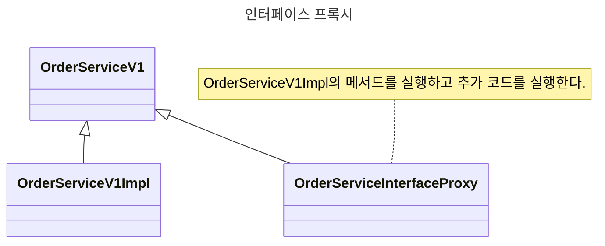
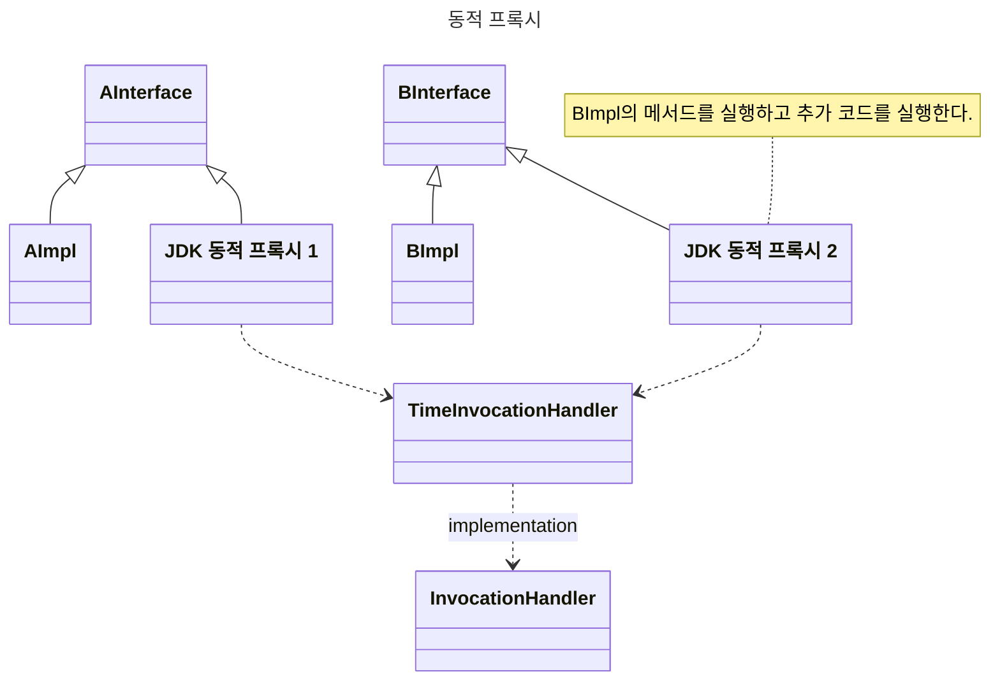
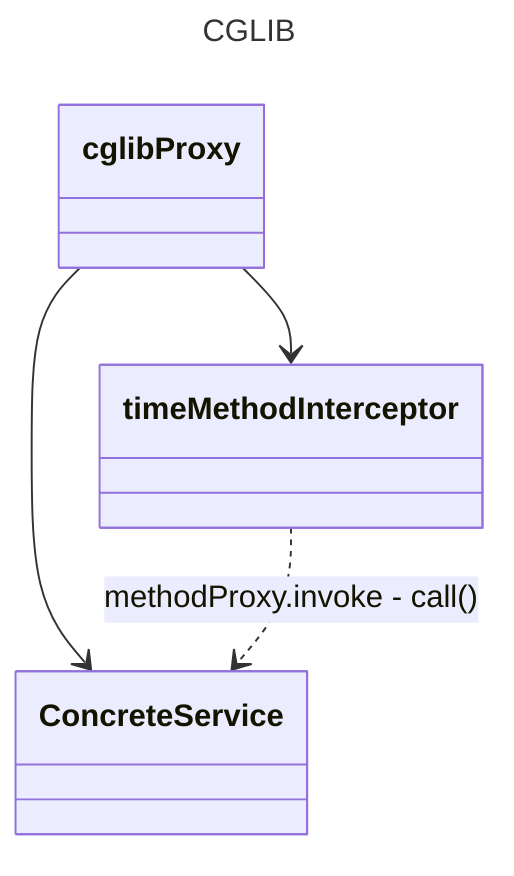

# 프록시


## 인터페이스 프록시

관리할 프록시 구현 클래스가 많아질 경우 동적 프록시로 대체 가능


## JDK 동적 프록시


JDK 동적 프록시는 인터페이스 필수다.
InvocationHandler 를 상속 받은 구현 클래스를 만들어 놓으면 이 구현 클래스를 재사용 가능하다.
100개의 프록시 클래스를 만들지 않아도 된다.


> **한계**
>
> 인터페이스 없이 클래스만 있는 경우에는 동적 프록시 적용이 불가능하다.


## CGLIB



**CGLIB** : Code Generator Library

바이트 코드를 조작해서 동적으로 클래스 생성하는 라이브러리.

인터페이스가 없는 클래스도 동적으로 프록시 적용이 가능하다.

단점 : 구현 클래스에 기본 생성자 추가 및 의존 관계를 setter를 사용해서 주입해야한다.


## Proxy Factory
인터페이스가 있는 경우에는 JDK 동적 프록시 사용
인터페이스가 없는 경우에는 CGLIB을 사용하는데,
`InvocationHandler` 와 `MethodInterceptor` 를 중복으로 만들어 사용해야하나? 

프록시 팩토리는 인터페이스가 있다면 JDK, 구체 클래스만 있다면 CGLIB를 사용한다.

### 인터페이스

``` java
final ServiceImpl target = new ServiceImpl();

final ProxyFactory proxyFactory = new ProxyFactory(target);
```


### 클래스 
``` java
final ConcreteService target = new ConcreteService();

final ProxyFactory proxyFactory = new ProxyFactory(target);
```

### 인터페이스라도 클래스 강제하기
``` java
final ServiceInterface target = new ServiceImpl();
ProxyFactory proxyFactory = new ProxyFactory(target);
proxyFactory.setProxyTargetClass(true); // setProxyTargetClass true 설정 시, 인터페이스가 있더라도 cglib 사용한다.
```


## 포인트컷, 어드바이스, 어드바이저
- **포인트컷(Pointcut)** : **'어디'** 에 부가 기능을 사용할지, 판단하는 필터링 로직
- **어드바이스(Advice)** : 프록시가 호출하는 부가 **'기능'** 이다
- **어드바이저(Advisor)** : **어드바이스1 + 포인트컷1** , 어드바이스와 포인트컷을 가지고 있는 것. 