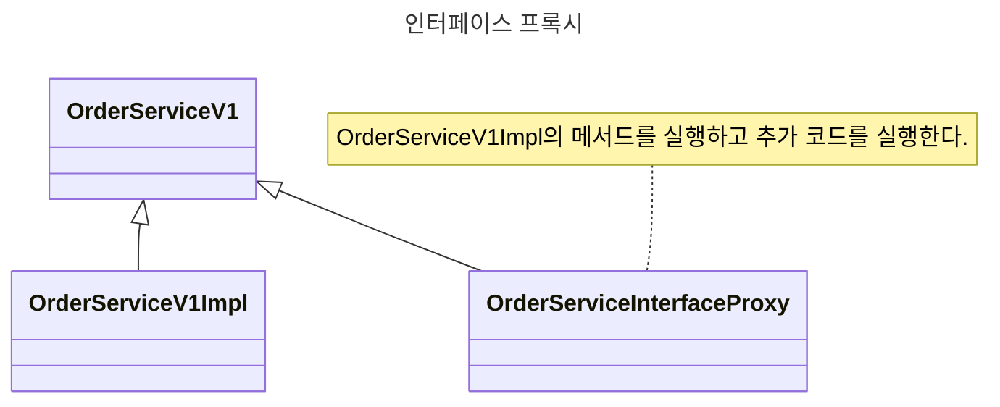
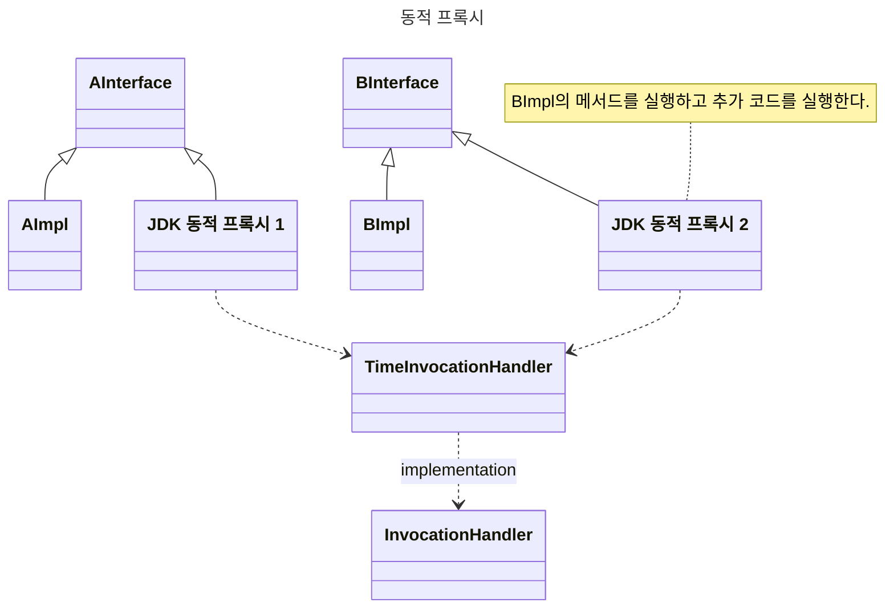

# 프록시

## 인터페이스 프록시

```mermaid
---
title: 인터페이스 프록시
---
classDiagram
    OrderServiceV1 <|-- OrderServiceV1Impl
    OrderServiceV1 <|-- OrderServiceInterfaceProxy
    note for OrderServiceInterfaceProxy "OrderServiceV1Impl의 메서드를 실행하고 추가 코드를 실행한다."


    
```
관리할 프록시 구현 클래스가 많아질 경우 동적 프록시로 대체 가능

## 동적 프록시

```mermaid
---
title: 동적 프록시
---
classDiagram
    class AInterface
    class BInterface
    class AImpl
    class BImpl
    class DynamicProxy1["JDK 동적 프록시 1"]
    class DynamicProxy2["JDK 동적 프록시 2"]
    class InvocationHandler

    AInterface <|-- AImpl
    BInterface <|-- BImpl
    AInterface <|-- DynamicProxy1
    BInterface <|-- DynamicProxy2
    
    note for DynamicProxy2 "BImpl의 메서드를 실행하고 추가 코드를 실행한다."


    DynamicProxy1 ..> TimeInvocationHandler 
    DynamicProxy2 ..> TimeInvocationHandler
    
    TimeInvocationHandler ..> InvocationHandler : implementation
    
```
InvocationHandler를 사용해서 동적으로 프록시를 생성 가능 

> **한계**
>
> 인터페이스 없이 클래스만 있는 경우에는 동적 프록시 적용이 불가능하다.

