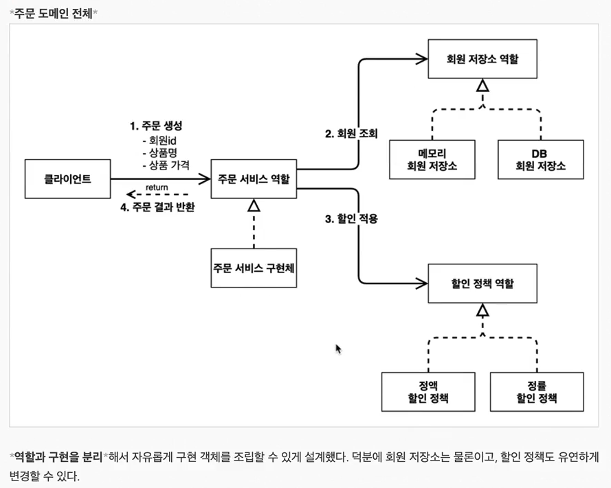
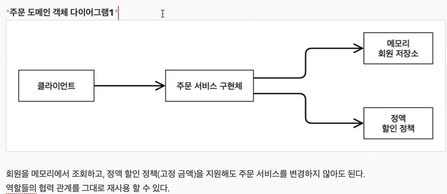
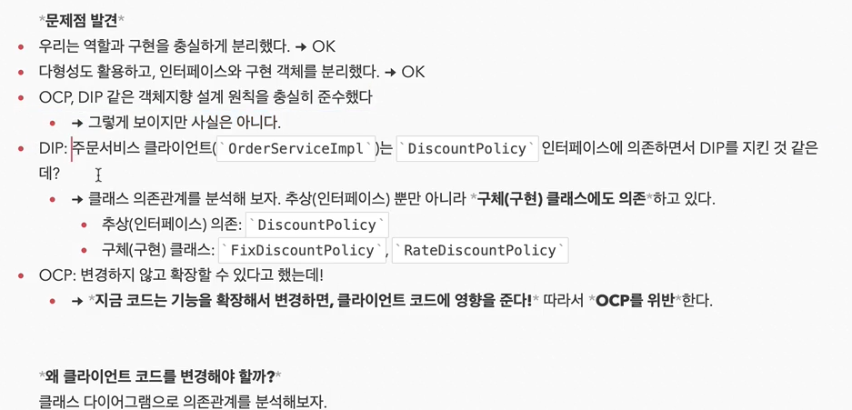
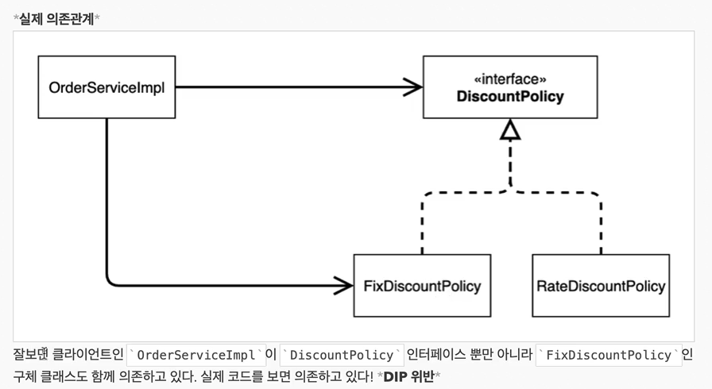

현재 만든 MemberServiceImpl 서비스는 OCP(개방 폐쇄), DIP(의존관계역전원칙)을 따르고 있는 것일까??
현재는 의존 관계가 인터페이스 뿐만 아니라 구현까지 모두 의존하고 있는 문제점이 있다.
MemberRepository 인터페이스와 MemmoryMemberRepository구현체 두 가지를 다 의존하고 있음.
```java
public class MemberServiceImpl implements MemberService {
    private final MemberRepository memberRepository = new MemmoryMemberRepository();
}
```
주문을 만들면서 수정하는 걸로


### 주문과 할인 도메인 설계
주문과 할인 정책
- 회원은 상품을 주문할 수 있다.
- 회원등급에 따라 할인 정책을 적용할 수 있다.
- 할인 정책은 모든 VIP는 1000원을 할인해주는 고정 금액 할인을 적용해달라.(나중에 변경 가능)
- 할인 정책은 변경 가능성이 높다. 회사의 기본 할인 정책을 아직 정하지 못했고, 오픈 직전까지 고민을 미루고 싶다.
- 최악의 경우 할인을 적용하지 않을 수 있다.(미확정)


### 주문 도메인 전체



### 주문 도메인 클래스 다이어그램 


### 주문 도메인 객체 다이어그램1


### 주문 도메인 객체 다이어그램2


### 새로운 할인 정책 개발


### 할인 정책의 문제점 발견
```java
public class OrderServiceImpl implements OrderService{
    //    private final DiscountPolicy discountPolicy = new FixDiscountPolicy();
    private final DiscountPolicy discountPolicy = new RateDiscountPolicy();
}
```




결론은 인터페이스에만 의존해야한다!

